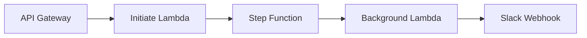
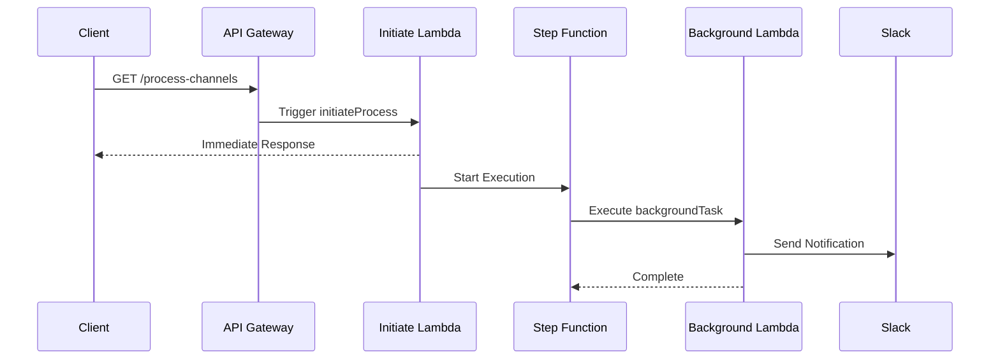

# Serverless Background Task with Step Functions

This project demonstrates how to implement background processing using AWS Lambda and Step Functions with the Serverless Framework.

## Architecture



## Project Structure

```
.
├── handlers/
│   ├── initiate.js     # HTTP endpoint handler
│   └── background.js   # Background task handler
├── serverless.yml      # Serverless Framework configuration
├── package.json        # Project dependencies
└── README.md          # Project documentation
```

## Components

### 1. API Gateway (HTTP API)

- Endpoint: `GET /process-channels`
- Returns immediate response while processing continues in background
- Configured using `httpApi` events in `serverless.yml`

### 2. Step Functions

- State Machine Name: `${service-name}-${stage}`
- Single state workflow that executes the background task
- Configuration in `serverless.yml`:

```yaml
stepFunctions:
  stateMachines:
    ProcessingStepFunction:
      name: ${self:service}-${opt:stage, 'dev'}
      definition:
        StartAt: BackgroundProcessing
        States:
          BackgroundProcessing:
            Type: Task
            Resource:
              Fn::GetAtt: [BackgroundTaskLambdaFunction, Arn]
            End: true
```

### 3. Lambda Functions

- **Initiate Process (`handlers/initiate.js`)**
  - Triggers Step Function execution
  - Returns immediate response to client
- **Background Task (`handlers/background.js`)**
  - Executes long-running process
  - Sends notification to Slack
  - Managed by Step Functions

## Detailed Configuration Flow

### 1. Serverless Configuration Breakdown

```yaml
functions:
  initiateProcess: # HTTP Endpoint Handler
    handler: handlers/initiate.handler
    events:
      - httpApi: # Creates API Gateway endpoint
          path: /process-channels
          method: GET
    environment:
      STATE_MACHINE_ARN: !Sub arn:aws:states:${AWS::Region}:${AWS::AccountId}:stateMachine:${self:service}-${self:provider.stage}

  backgroundTask: # Background Process Handler
    handler: handlers/background.handler
    timeout: 30
    environment:
      NODE_ENV: ${opt:stage, 'dev'}
```

### 2. Function Flow

1. **API Gateway Trigger**

   - HTTP request hits `/process-channels` endpoint
   - Automatically routes to `initiateProcess` function
   - Uses HTTP API (faster and cheaper than REST API)

2. **Step Function Integration**

   ```yaml
   stepFunctions:
     stateMachines:
       ProcessingStepFunction:
         name: ${self:service}-${opt:stage, 'development'}
         definition:
           StartAt: BackgroundProcessing
           States:
             BackgroundProcessing:
               Type: Task
               Resource:
                 Fn::GetAtt: [BackgroundTaskLambdaFunction, Arn]
               End: true
   ```

   - State machine executes single task
   - References background Lambda using CloudFormation function
   - Manages execution state and retries

3. **IAM Permissions Chain**
   ```yaml
   iam:
     role:
       statements:
         - Effect: Allow
           Action:
             - states:StartExecution
           Resource:
             - !Sub arn:aws:states:${AWS::Region}:${AWS::AccountId}:stateMachine:${self:service}-${self:provider.stage}
   ```
   - Initiate Lambda needs permission to start Step Function
   - Step Function needs permission to invoke background Lambda
   - Background Lambda needs permission to call Slack webhook

### 3. Dynamic Configuration

The service uses several dynamic values:

- **Region**: `${opt:region, 'eu-central-1'}`

  - Takes region from command line or defaults to eu-central-1
  - Used in ARN construction and deployment

- **Stage**: `${opt:stage, 'development'}`

  - Controls deployment environment
  - Affects function names and Step Function name
  - Used in environment variables

- **Service Name**: `${self:service}`
  - Used in resource naming
  - Ensures unique resources across accounts

### 4. Environment Variables

Variables are passed through multiple levels:

1. **Provider Level**

   ```yaml
   provider:
     environment:
       SLACK_WEBHOOK_URL: ${param:SLACK_WEBHOOK_URL}
   ```

   - Available to all functions
   - Managed via Serverless parameters

2. **Function Level**
   ```yaml
   functions:
     initiateProcess:
       environment:
         STATE_MACHINE_ARN: !Sub arn:aws:states:...
     backgroundTask:
       environment:
         NODE_ENV: ${opt:stage, 'development'}
   ```
   - Function-specific variables
   - Override provider-level variables

### 5. Local Development

The configuration supports local testing:

```yaml
plugins:
  - serverless-step-functions
  - serverless-offline

custom:
  serverless-offline:
    httpPort: 3000
    noPrependStageInUrl: true
```

- `serverless-offline`: Emulates API Gateway locally
- `serverless-step-functions`: Emulates Step Functions locally
- Custom port configuration for local development

### 6. Package Configuration

```yaml
package:
  patterns:
    - "!.git/**"
    - "!.vscode/**"
    - "!test/**"
    - "!README.md"
```

- Controls what files are deployed
- Excludes development-only files
- Reduces deployment package size

## Flow Diagram



## Setup

1. Install dependencies:

```bash
npm install
```

2. Set up Slack webhook URL:

```bash
serverless param set SLACK_WEBHOOK_URL <your-webhook-url>
```

3. Deploy:

```bash
npm run deploy
```

## Local Development

1. Start local server:

```bash
npm start
```

2. Test background task:

```bash
npm run test:background
```

## Configuration

### Environment Variables

- `SLACK_WEBHOOK_URL`: Slack webhook URL for notifications
- `NODE_ENV`: Environment name (defaults to stage name)

### IAM Permissions

The service automatically configures required permissions:

- Lambda execution role
- Step Functions state machine role
- Permission to start Step Function execution

## Deployment

Deploy to different stages:

```bash
# Development
serverless deploy --stage dev

# Production
serverless deploy --stage prod --param="SLACK_WEBHOOK_URL=<webhook-url>"
```

## Testing

Test the endpoint:

```bash
# Local
curl http://localhost:3000/process-channels

# Production
curl https://<api-id>.execute-api.<region>.amazonaws.com/process-channels
```

## Monitoring

- View Step Function executions in AWS Console
- Check CloudWatch logs for both Lambda functions
- Monitor Slack channel for notifications

## Troubleshooting

Common issues:

1. Missing SLACK_WEBHOOK_URL parameter
   - Solution: Set parameter using `serverless param set`
2. Permission errors

   - Check IAM roles in `serverless.yml`
   - Verify Step Functions execution role

3. Timeout issues
   - Adjust timeout settings in `serverless.yml`
   - Background task default timeout: 30 seconds
